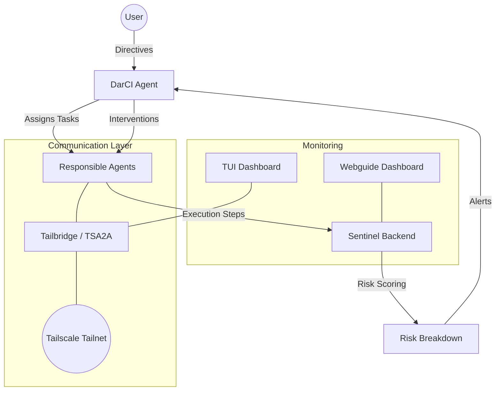

# SentinelAI 🛡️

**Real-time risk assessment and adaptive intervention for autonomous AI agents.**

SentinelAI is a proactive monitoring and management layer for agentic AI systems. It prevents silent failures—such as infinite loops, goal drift, and hallucination—by scoring agent actions in real-time and applying corrective interventions.

Built for **Hack Canada 2026**, SentinelAI embodies the philosophy of *Abolishing Monostandardism* in AI management, treating diverse agents with specialized, contextual equity rather than rigid, uniform standards.

---

## 🏗️ System Architecture

SentinelAI operates as a multi-layer ecosystem:



### Core Components

- **[Sentinel](backend/)**: The "Approver." A FastAPI backend that performs semantic analysis and calculates risk scores (0.0 - 1.0) across 4 dimensions: Loop Detection, Goal Drift, Confidence (Hallucination/Hedge Words), and Coherence.
- **[DarCI](darci/)**: The "Driver." An autonomous project manager that coordinates agents, creates tasks, and executes interventions (Reprompt, Rollback, Decompose, Halt).
- **[Tailbridge](tailbridge/)**: The communication backbone. Uses [Tailscale](https://tailscale.com/) for secure, peer-to-peer agent communication.
  - **[TSA2A](tailbridge/taila2a/docs/)**: Tailscale Agent-to-Agent protocol for auto-discovery, authentication, and handshaking
  - **TailFS**: Chunked file transfers over Tailscale
- **[DarCI Framework](darci/)**: The foundational agent framework with Python and Go implementations for building specialized workers.
- **[Frontend](frontend/)**: The `Webguide` dashboard. A React-based interface for real-time risk monitoring and agent telemetry.
- **[TUI](tailbridge/taila2a/cmd/taila2a/tui/)**: Terminal-based Bubbletea dashboard for monitoring agents, topics, and transfers in real-time.

---

## 🚀 Hack Canada 2026 Focus

### 1. Most Technically Complex AI Hack 🥇
- **Agentic Loop**: Full ReAct-style reasoning (Thought → Action → Observation).
- **Semantic Risk Scoring**: Uses word overlap and hedging language detection to identify deviation from the user's goal.
- **Adaptive Interventions**: Automates 4 distinct recovery strategies matched to failure severity.

### 2. Tailscale Integration Challenge 🥈
- **TSA2A Protocol**: Secure, distributed agent-to-agent communication over a tailnet with:
  - Auto-discovery via mDNS, Tailscale DNS, and gossip protocols
  - Tailscale identity-based authentication (no HTTPS needed)
  - Automatic handshaking and capability negotiation
  - Policy-based authorization and rate limiting
- **Agent Discovery**: Mechanical "phone book" discovery of peer agents without centralized servers.
- **Safe Transfers**: End-to-end encrypted file sharing via TailFS.

### 3. Best Use of Gemini API 🥉
- **Advanced Reasoning**: Powered by `gemini-2.0-flash` and `gemini-1.5-pro` for high-fidelity tool selection and complex goal decomposition.

---

## 🛠️ Quick Start

### Prerequisites
- Python 3.10+
- Node.js 18+
- Go 1.21+ (for DarCI-Go and Tailbridge)
- [Tailscale](https://tailscale.com/) (authenticated and running)
- Google Gemini API Key

### Installation

1. **Clone the repository**:
   ```bash
   git clone https://github.com/anthony-zhdanov/sentinelai.git
   cd sentinelai
   ```

2. **Configure Environment**:
   ```bash
   cp .env.example .env
   # Add your GEMINI_API_KEY to .env
   ```

3. **Install Dependencies**:
   ```bash
   # Python dependencies
   pip install -r requirements.txt
   
   # Frontend
   cd frontend && npm install
   
   # Go dependencies (for Tailbridge and DarCI-Go)
   cd ../tailbridge/taila2a && go mod tidy
   cd ../../darci/engineering_notebook_archive/darci-go && go mod tidy
   ```

4. **Start Tailscale** (if not running):
   ```bash
   tailscale up
   ```

5. **Run Sentinel Backend**:
   ```bash
   python -m backend.main
   ```

6. **Run DarCI Agent** (Python):
   ```bash
   python -m darci
   ```

7. **Run Tailbridge** (TSA2A communication):
   ```bash
   cd tailbridge/taila2a
   go run cmd/taila2a/main.go
   ```

8. **Run TUI Dashboard** (optional):
   ```bash
   cd tailbridge/taila2a
   go run cmd/taila2a/main.go tui
   ```

9. **Run Frontend** (Webguide Dashboard):
   ```bash
   cd frontend
   npm start
   ```

---

## 📁 Project Structure

```
sentinelai/
├── backend/              # Sentinel risk assessment API
├── darci/                # DarCI agent framework
│   ├── engineering_notebook_archive/  # Archived implementations
│   │   ├── darci-python/              # Python agent implementation
│   │   └── darci-go/                  # Go agent implementation
│   ├── models/           # Data models
│   ├── tools/            # Agent tools
│   └── workspace/        # Agent workspace and skills
├── frontend/             # React dashboard (Webguide)
├── tailbridge/           # Tailscale communication layer
│   └── taila2a/          # TSA2A protocol implementation
│       ├── bridge/       # Agent bridge
│       ├── cmd/          # CLI and TUI
│       ├── docs/         # TSA2A documentation
│       └── internal/     # Internal packages
├── test_suite/           # Integration and demo tests
└── engineering-notebook/ # Development notes
```

---

## 📚 Documentation

- **[TSA2A Protocol](tailbridge/taila2a/docs/README.md)** - Complete protocol specification
- **[TSA2A Quickstart](tailbridge/taila2a/docs/TSA2A-QUICKSTART.md)** - Get started in 5 minutes
- **[TSA2A Architecture](tailbridge/taila2a/docs/TSA2A-ARCHITECTURE.md)** - System design
- **[TSA2A Authentication](tailbridge/taila2a/docs/TSA2A-AUTH.md)** - Security model
- **[Integration Testing](test_suite/integration/README.md)** - Test suite documentation

---

## 📄 License

Distributed under the MIT License. See `LICENSE` for more information.

---

## 🇨🇦 Hack Canada 2026

*Abolishing Monostandardism — One Agent at a Time.*

**Built with pride for Hack Canada 2026** 🍁
