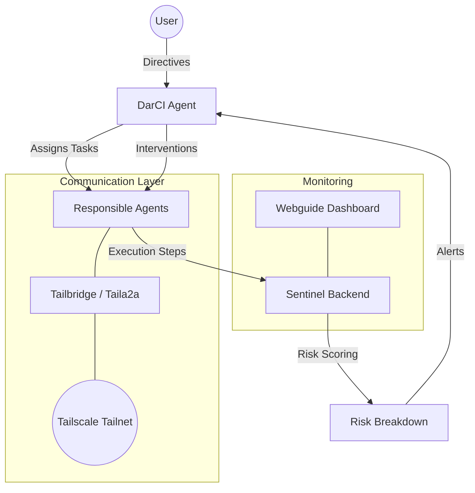

# SentinelAI 🛡️

**Real-time risk assessment and adaptive intervention for autonomous AI agents.**

SentinelAI is a proactive monitoring and management layer for agentic AI systems. It prevents silent failures—such as infinite loops, goal drift, and hallucination—by scoring agent actions in real-time and applying corrective interventions.

Built for **Hack Canada 2026**, SentinelAI embodies the philosophy of *Abolishing Monostandardism* in AI management, treating diverse agents with specialized, contextual equity rather than rigid, uniform standards.

---

## 🏗️ System Architecture

SentinelAI operates as a multi-layer ecosystem:



### Core Components

- **[Sentinel](backend/)**: The "Approver." A FastAPI backend that performs semantic analysis and calculates risk scores (0.0 - 1.0) across 4 dimensions: Loop Detection, Goal Drift, Confidence (Hedge Words), and Coherence.
- **[DarCI](darci/)**: The "Driver." An autonomous project manager that coordinates agents, creates tasks, and executes interventions (Reprompt, Rollback, Decompose, Halt).
- **[Tailbridge](tailbridge/)**: The communication backbone. Uses [Tailscale](https://tailscale.com/) for secure, peer-to-peer agent discovery (`Taila2a`) and chunked file transfers (`TailFS`).
- **[Scorpion](scorpion/)**: The foundational agent framework. Supports both Python and Go implementations for building specialized workers.
- **[Frontend](frontend/)**: The `Webguide` dashboard. A React-based interface for real-time risk monitoring and agent telemetry.

---

## 🚀 Hack Canada 2026 Focus

### 1. Most Technically Complex AI Hack 🥇
- **Agentic Loop**: Full ReAct-style reasoning (Thought → Action → Observation).
- **Semantic Risk Scoring**: Uses word overlap and hedging language detection to identify deviation from the user's goal.
- **Adaptive Interventions**: Automates 4 distinct recovery strategies matched to failure severity.

### 2. Tailscale Integration Challenge 🥈
- **Taila2a Protocol**: Secure, distributed agent-to-agent communication over a tailnet.
- **Agent Discovery**: Mechanical "phone book" discovery of peer agents without centralized servers.
- **Safe Transfers**: End-to-end encrypted file sharing via TailFS.

### 3. Best Use of Gemini API 🥉
- **Advanced Reasoning**: Powered by `gemini-1.5-pro` and `gemini-1.5-flash` for high-fidelity tool selection and complex goal decomposition.

---

## 🛠️ Quick Start

### Prerequisites
- Python 3.10+
- Node.js 18+
- Tailscale (authenticated and running)
- Google Gemini API Key

### Installation

1. **Clone the repository**:
   ```bash
   git clone https://github.com/[your-username]/sentinelai.git
   cd sentinelai
   ```

2. **Configure Environment**:
   ```bash
   cp .env.example .env
   # Add your GEMINI_API_KEY to .env
   ```

3. **Install Dependencies**:
   ```bash
   pip install -r requirements.txt
   cd frontend && npm install
   ```

4. **Run Sentinel Backend**:
   ```bash
   python -m backend.main
   ```

5. **Run DarCI Agent**:
   ```bash
   python -m darci
   ```

---

## 📄 License

Distributed under the MIT License. See `LICENSE` for more information.

---

*Abolishing Monostandardism — One Agent at a Time.* 🇨🇦
